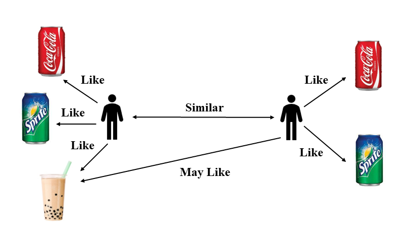

# Github_Recommendation
## Introduction
This project is supported by the open source summer activity and the towhee community. It aims to design an efficient recommendation algorithm to recommend favorite projects for users.

## Development Progress
* Data Collection
* Baseline algorithm design
* **DL algorithm design**
* Analysis and comparison

## Data Description
* The data field contains five fields, namely, the user name, the project name (full name), the number of stars and forks of the project, and whether the user has starred the project.The data is organized into CSV files as follows.

| user | project | star | fork | has_star |
| ---- | ---- | ---- |---- |---- |

* Based on different requirements, we provide four types of data for users to process:`users`,`projects`,`data_demo`,`data_clean`
    - `users`: User information table, include the mapping relationship between index and username
    - `projects`:Project information table, use three fileds('name', 'star', 'fork') to depict projects
    - `data_demo`:A small data set for users to do pre experiments,include 3000 users, 182404 projects, 929489 records totally.
    - `data_clean`: Projects with no more than 10 stars are filtered in the `data_raw`, include 70129 users, 271530 projects, 21775242 records totally.

## Baseline Algorithm
* User-based Collaborative Filtering

## DL Algorithm Design
* GC-MC(Graph Convolution Matrix Completion, Berg et al. KDD 2018)

* IG-MC(Inductive Graph-based Matrix Completion, Zhang et al. ICLR 2019)

